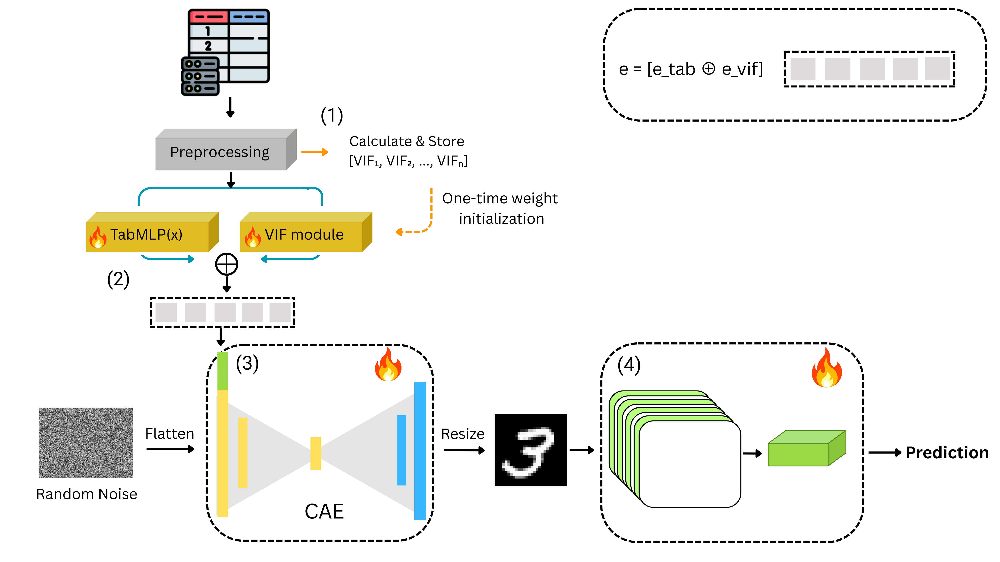

# Tab2Vis: Efficient and Interpretable Tabular Learning via Visual Transformation

[](https://doi.org/10.1109/ICHMS69701.2026.11602339)
[](https://doi.org/10.1109/ICHMS69701.2026.11602339)
[](#license)

Official implementation of:

> **Efficient and Interpretable Tabular Learning via Visual Transformation**
> Amin Hajjari, Jamal Seyedmohammadi, Mohammad Taghi Sadeghi, Jamshid Abouei, Pai Chet Ng, Arash Mohammadi
> *2026 IEEE International Conference on Human-Machine Systems (ICHMS)*, Singapore, 2026, pp. 287–292.
> DOI: [10.1109/ICHMS69701.2026.11602339](https://doi.org/10.1109/ICHMS69701.2026.11602339)


---

## Overview

Tabular data remains one of the most common data modalities in high-stakes domains such as healthcare and finance, yet deep learning models often trail behind gradient-boosted trees in both efficiency and interpretability. **Tab2Vis** is a lightweight tabular-to-image framework that converts tabular samples into **28×28 grayscale images**, letting a CNN exploit visual inductive biases while preserving semantic alignment with the original features.

Tab2Vis combines three components:

- **Dataset-level VIF initialization** — Variance Inflation Factor is computed **once** during preprocessing (not per training batch) and used to initialize network weights, reducing complexity from `O(B·N²)` to `O(N²)` while down-weighting redundant, collinear features.
- **Dual-branch conditional autoencoder (CAE)** — a standard MLP branch and a VIF-aware branch jointly condition a lightweight autoencoder that synthesizes class-discriminative images, which a CNN then classifies.
- **DualSHAP** — a training-free interpretability mechanism that computes kernel SHAP attributions in both the tabular domain (within-modal) and the image domain (cross-modal), giving consistent, complementary feature explanations without any auxiliary models.

Evaluated on **67 OpenML-CC18 benchmark datasets**, Tab2Vis reaches **86.95% average accuracy / 0.9143 AUC**, outperforming Table2Image, HACNet, TabM, TuneTables, and FT-Transformer, while processing a full dataset in **~5–6 minutes** versus **40–90 minutes** for the closest VIF-based baseline — an **8–15× speedup**.

<p align="center">
  
</p>

<p align="center"><em>The Tab2Vis pipeline. Tabular data flows through (1) preprocessing and one-time VIF calculation, (2) dual-branch embedding (TabMLP + VIF module), (3) CAE-based image generation conditioned on the embedding and random noise, and (4) CNN-based classification.</em></p>

## Results

| Model | Avg. Accuracy | Avg. AUC |
|---|---|---|
| Logistic Regression | 0.7831 | 0.8758 |
| SVM | 0.7839 | 0.8745 |
| Random Forest | 0.8530 | 0.9109 |
| XGBoost | 0.8675 | 0.8758 |
| LightGBM | 0.8612 | 0.9116 |
| CatBoost | 0.8626 | 0.9146 |
| TabM | 0.8411 | 0.8960 |
| TuneTables | 0.8650 | 0.9145 |
| FT-Transformer | 0.8313 | 0.9016 |
| Table2Image (T2I) | 0.8370 | 0.8781 |
| Table2Image-VIF (T2I-V) | 0.8391 | 0.9019 |
| **Tab2Vis (ours)** | **0.8695** | **0.9143** |

Full per-dataset results, efficiency comparisons, and the optimizer ablation are reported in the paper (Tables I–III).

## Repository Structure

```
Tab2Vis/
├── run_vif.py              # Core pipeline: preprocessing, VIF init, dual-branch CAE,
│                            # CNN classifier, and DualSHAP interpretability
├── run_all_datasets.py     # Batch driver that runs run_vif.py over a folder of datasets
│                            # and aggregates results into CSV / LaTeX summary tables
├── run_table2image.sh      # SLURM job script for a full production run (all datasets)
└── test_interpretability.sh# SLURM job script for a quick smoke test on a few small datasets
```

## Requirements

- Python 3.11
- PyTorch + torchvision (CUDA build recommended)
- `scikit-learn`, `pandas`, `numpy`, `scipy`
- `statsmodels` (VIF computation)
- `shap`
- `adopt` (ADOPT optimizer)
- `matplotlib`, `tqdm`

Install the core dependencies with:

```bash
pip install torch torchvision scikit-learn pandas numpy scipy statsmodels shap adopt matplotlib tqdm
```

## Data Format

Each dataset lives in its own folder containing a single `.csv`, `.arff`, or `.data` file, e.g.:

```
datasets/
├── credit-g/
│   └── credit-g.csv
├── tic-tac-toe/
│   └── tic-tac-toe.arff
└── balance-scale/
    └── balance-scale.data
```

Datasets are those used in the [OpenML-CC18](https://www.openml.org/search?type=study&study_type=task&id=99) benchmark suite.

### Datasets used in the paper

Tab2Vis is evaluated on the following 67 OpenML-CC18 datasets:

<details>
<summary>Click to expand full dataset list</summary>

`kr-vs-kp`, `breast-2`, `credit-approval`, `credit-g`, `diabetes`, `sick`, `spambase`, `tic-tac-toe`, `electricity`, `pc4`, `pc3`, `jm1`, `kc2`, `kc1`, `pc1`, `balance-scale`, `cmc`, `splice`, `connect-4`, `dna`, `jungle-chess`, `vehicle`, `analcatdata-authorship`, `GesturePhaseSegmentationProcessed`, `analcatdata-dmft`, `har`, `segment`, `cnae-9`, `mfeat-fourier`, `mfeat-morphological`, `optdigits`, `mfeat-pixel`, `semeion`, `texture`, `bank-marketing`, `banknote-authentication`, `blood-transfusion-service-center`, `ilpd`, `madelon`, `nomao`, `ozone-level-8hr`, `phoneme`, `qsar-biodeg`, `wdbc`, `adult`, `Bioresponse`, `PhishingWebsites`, `cylinder-bands`, `dresses-sales`, `numerai28.6`, `InternetAdvertisements`, `wilt`, `climate-model-simulation-crashes`, `churn`, `car`, `wall-robot-navigation`, `eucalyptus`, `satimage`, `first-order-theorem-proving`, `steel-plates-fault`, `MiceProtein`, `mfeat-factors`, `mfeat-karhunen`, `mfeat-zernike`, `pendigits`, `CIFAR-10`, `vowel`

</details>

## Usage

### Single dataset

```bash
python run_vif.py \
  --data /path/to/datasets/credit-g/credit-g.csv \
  --num_images 20 \
  --interp_root /path/to/results/interpretability
```

Arguments:
| Flag | Description | Default |
|---|---|---|
| `--data` | Path to a single dataset file (csv/arff/data) | required |
| `--num_images` | Number of sample images to save per dataset (capped at 20) | 20 |
| `--interp_root` | Output root for DualSHAP interpretability artifacts | current directory |
| `--save_dir` | Optional results directory (kept for compatibility) | none |

### Batch processing (all datasets in a folder)

```bash
python run_all_datasets.py \
  --datasets_dir /path/to/datasets \
  --output_base /path/to/results \
  --job_id local_run \
  --script_path ./run_vif.py \
  --timeout 7200 \
  --skip_existing
```

This produces a timestamped run directory `results/<date>_JOB<job_id>/` with:

```
results_summary.csv          # per-dataset accuracy / AUC
statistics.csv                # aggregate accuracy / AUC statistics
results_latex.txt             # ready-to-paste LaTeX results table
interpretability_summary.csv  # DualSHAP completeness per dataset
logs/results.jsonl            # raw per-dataset JSON results
logs/progress_log.jsonl       # run-level success / failure log
```

### Running on a SLURM cluster

`run_table2image.sh` is a production SLURM script (A100 GPU, 96h walltime) that runs the full batch of datasets with weight decay and DualSHAP enabled. `test_interpretability.sh` is a shorter script for validating the pipeline on a handful of small datasets before launching a full run. Both scripts assume a Python virtual environment and expect `--account`, module names, and paths to be adjusted to your own cluster configuration.

```bash
sbatch run_table2image.sh
```

## Interpretability (DualSHAP)

For every processed instance, Tab2Vis saves nine files under `interp_root/<dataset_name>/dual_shap_interpretability/`:

- `shap_tab2img_<idx>.csv`, `shap_tab2tab_<idx>.csv`, `dual_shap_summary_<idx>.csv` — per-feature SHAP values (cross-modal, within-modal, and combined)
- `importance_tab2img_<idx>.png`, `importance_tab2tab_<idx>.png`, `dual_shap_comparison_<idx>.png` — importance plots
- `shap_tab2img_raw_<idx>.npy`, `shap_tab2tab_raw_<idx>.npy` — raw SHAP arrays
- `dual_shap_report_<idx>.txt` — human-readable summary report

These attributions require no auxiliary model training, using kernel SHAP directly on the trained Tab2Vis model with a fixed noise vector for deterministic outputs.

## Citation

If you use this code or build on Tab2Vis, please cite:

```bibtex
@INPROCEEDINGS{hajjari2026tab2vis,
  author={Hajjari, Amin and Seyedmohammadi, Jamal and Sadeghi, Mohammad Taghi and Abouei, Jamshid and Ng, Pai Chet and Mohammadi, Arash},
  booktitle={2026 IEEE International Conference on Human-Machine Systems (ICHMS)},
  title={Efficient and Interpretable Tabular Learning Via Visual Transformation},
  year={2026},
  address={Singapore, Singapore},
  pages={287-292},
  doi={10.1109/ICHMS69701.2026.11602339}
}
```

## License

This project is released under the [MIT License](LICENSE).

## Contact

For questions about the paper or code, please open an issue on this repository.
